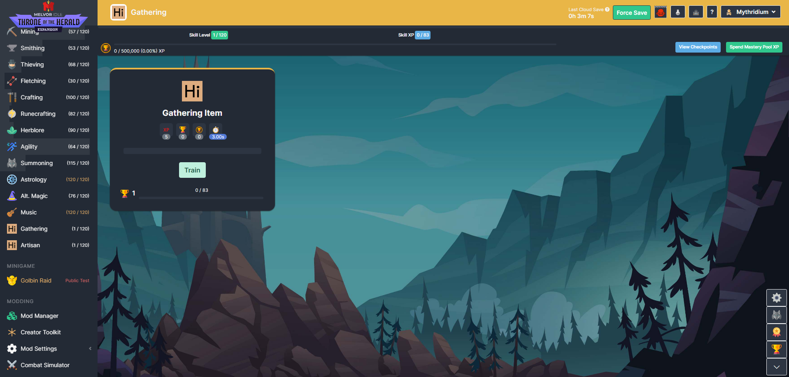
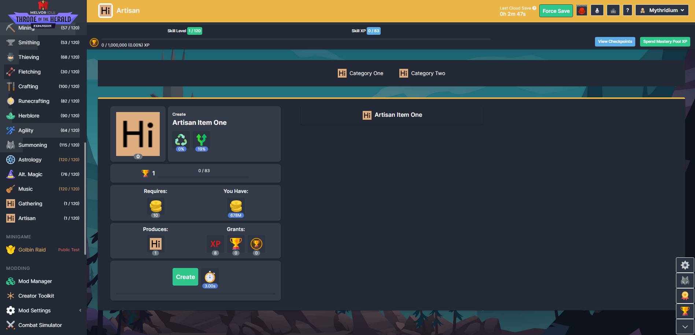

# [Myth] Skill Template

This is a boilerplate template on adding a skill to the game. This provides an example for setting up both artisan and gathering skills.

## Requirements
This repo requires you to have:
* Node.JS (I use v18+ but we aren't interacting with the node runtime much, other then running webpack and zipping the contents for this so most versions will work)
* NPM (the version bundled with node.js should be fine, I use v9+)

It was primarily designed to be developed with VS Code and integrates the prettier extension to automatically format code on save.

**This guide assumes you have some experience modding Melvor Idle and you are familiar with the Mod Creation guides on the wiki. I won't go over the absolute basics.**

https://wiki.melvoridle.com/w/Mod_Creation

## Disclaimer

This boilerplate is a modified version of the boilerplate from https://github.com/CherryMace/melvor-idle-mod-boilerplate-ts.

This is not the best way, nor the only way to implement a skill. This is merely how I have decided to implement adding a new skill. You are free to augment this boilerplate as you see fit and in any way you want. I prefer using TypeScript, focusing on classes and petite-vue components. If you prefer something else, go for it. I also prefer to split things into multiple smaller files, if you want one giant file... more power to you!

Adding a new skill is complex, don't be discouraged.

## Assets
I have provided a blank mastery token, summoning mark and summoning tablet. These were assets taken from the wiki, and I edited them to remove the logo's on them as these blank assets are not available from what I can find.

## Getting Started

* clone the repo
* open the folder in VS Code
* open a terminal
* run `npm i` to install npm packages
* run `npm run build` to run webpack, which compiles the TypeScript, bundles assets and zips the entire mod up into the `build` folder
* you can now use the `Creator Toolkit` to add a local mod and select the zip file that is in the `build` folder

## SCSS

Webpack automatically compiles scss to css and includes it in the output via importing the scss file into a TypeScript file.

`gathering.ts` - line 4 `import './gathering.scss';` is an example of this, it's as easy as this to include css.

## How To Start
You should first change the namespace in `manifest.json`, this will require updates in `data.json` and the majority of the files. Searching for `mythSkillTemplate` and replacing with your own namespace should be sufficient.

Next you could replace the `logo.png` found in the assets folder with your own logo.

After this you could pick which type of skill you are going to implement and start modifying the `skillData` in `data.json`, adding recipes and items, then updating the definitions in `gathering.types.ts` or `artisan.types.ts`.

You can then update the `registerData` functions as needed.

## Key Pieces

### `data.json`

Inside the `data.json` we need to define a `pages` property of type array and add our skill page definition there.

The next important section is the `skillData` object, this defines the basics of your skill, such as pets, mastery tokens, rare drops, additional data such as gathering skill items, or artisan recipe and category definitions.

### `setup.ts`

This is the entry point to the entire mod and simply launches the mod.

### `main.ts`

The `init` function is called from `setup.ts` and goes through some important steps to register your new skill.

* first, it includes all the html templates required by your mod.
* we then patch the event manager to support the new event type for the skill, this is because `game.constructEventMatcher` has no support for mods and strictly deals with in built events. So when the game would hit one of our custom events for our skill, it doesn't know what to do. By registering the event matchers, we tell the game what to do when it hits an event from your skill. An event is something like an action taking place; eg. mining a node
* we then register the skill with the game and pass in the class definition which the game constructs on our behalf.
* we then register the user interface for the skill
* finally, we patch a function on the completion log as there is a bug in the game. It does not count the current mastery actions for custom skills, it's basically missing the line we have added in the patch.

### Skills

Some general notes between both skill types.

`actionRewards` is a getter defined on the skill that determines the rewards to award on an action completing.

`name` is a getter defined on the skill that is the text displayed in the sidebar, without this defined the game attempts to look up via language strings and won't find your custom string.

`registerData` is where the skill data that was defined in `data.json` is passed into, here you can use that data to create concrete classes from the data and register them with the game. I've also added any custom translations strings we require in this function, however there are probably better ways/locations to do this.

`artisan.html` and `gathering.html`, there are some important html elements that the game looks for when a skill is registered. If you refer to the id's of these elements you'll see something like:

* `skill-header-mythSkillTemplate:Artisan`
* `skill-progress-level-mythSkillTemplate:Artisan`
* `skill-progress-xp-mythSkillTemplate:Artisan`

These three are the top panel which shows skill level, xp and mastery. The id needs to have a matching skill id otherwise you'll get errors. For example if I have a namespace of `test` with a skill registered `Mechanic` the id of the skill will be `test:Mechanic` and the id's above need to reflect that, such as `skill-progress-xp-test:Mechanic`.

`getActionIDFromOldID` is a legacy function that must be implemented, its fine to leave as returning an empty string from what I can tell, it shouldn't be used anymore.

### Gathering Skills

Gathering skills typically create individual components for each mastery action.

Gathering skills may typically need to encode and decode additional data. This is the data that needs to be preserved between the game being closed down and re-opened, such as the active item.

Actions within a petite-vue component do not automatically update, such as the grants (xp, mastery, interval) displayed on the tile. You need to trigger the renderQueue `renderQueue.renderGrants = true`. This in turn will process the `renderGrants` function the next time the `render` function is called. This triggers the update on the individual tiles which were registered in the `UserInterface` class during initialisation.

### Artisan Skills

Artisan skills typically give recipes and categories to in built classes.

Artisan skills require specific html elements and to register specific properties otherwise the skill will fail to load.

`artisan-category-menu` is the element for the horizontal category selectors.
`artisan-artisan-container` is the element for the game to output the recipes for the category.

## Image Compression

One tip I would recommend is compressing any images you use in your mod to keep file size down. An easy way I do this is via https://compresspng.com/ just drag and drop the images, download the compressed versions. This saves me 50-80% file size per image with almost no quality reduction. This can take a mod well over 1MB down to something manageable ~300kb.
